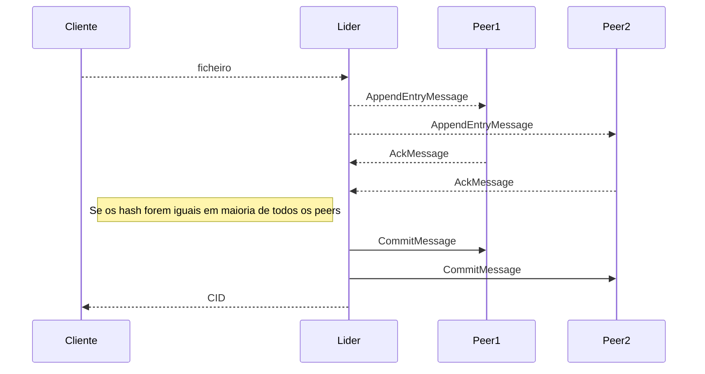
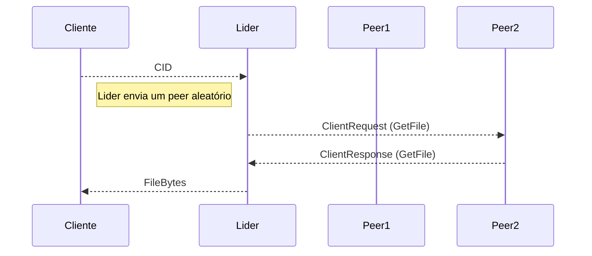
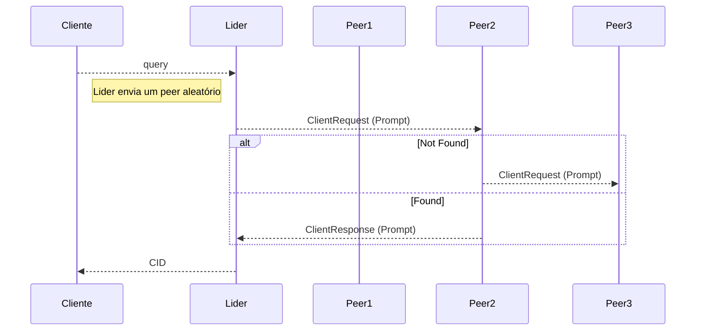
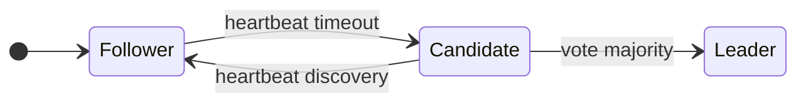

# Sistemas distribuídos

**Trabalho elaborado por:**

- Guilherme Bento - 25193

- Tiago Portugal - 30816

- Ricardo Matos - 22459

- Vasco Aparício - 22619

**Disciplina:** Sistemas Distribuídos

## Introdução

O projeto consiste na implementação de um sistema distribuído para o armanezamento e recuperação de ficheiros. Este trabalho foi constituído por sete sprints, dois dos quais de recuperação.

O grupo optou por implementar a solução com a linguagem de programação go(golang), de modo a utilizar a biblioteca `kubo (go-ipfs)`, na qual é baseada o `ipfs desktop` e `ipfs cli` (basicamente uma abstração da bibilioteca), para criar um projeto mais integrado sem recurso a *wrappers* ou comandos shell.

Todos os elementos do grupo interpretaram a implementação do projeto em `go` com entusiasmo, para poder ter *feedback* da linguagem, que tem vindo a ganhar popularidade.

## Objetivos

- Implementar armazenamento distribuído baseado em IPFS com identificação de ficheiros por CIDs​

- Desenvolver algoritmo de consenso inspirado no Raft para consistência entre peers​

- Integrar pesquisa semântica através de embeddings FAISS​

- Garantir tolerância a falhas com deteção e eleição automática de líder​

- Disponibilizar API REST para interação com cliente

## Arquitetura da solução UML

### | Add File - Diagrama de sequência



### | Get File - Diagrama de Sequência



### |Prompt - Diagrama de sequência:



### |Transição de rotinas - Diagrama de estados



## Implementação

#### Protocolo de Consenso

O sistema implementa uma variação do protocolo Raft com eleição de líder e replicação de vetores. O líder coordena a adição de ficheiros enviando `AppendEntryMessage` com o vetor de CIDs e embeddings para os peers. Após receber confirmação da maioria dos peers com hash correta, envia `CommitMessage` para confirmação definitiva.​

#### IPFS e Armazenamento

Cada ficheiro é identificado por um CID único baseado no hash do conteúdo. O IPFS garante que os ficheiros ficam distribuídos e acessíveis entre os peers da rede.​

#### Pesquisa Semântica

O sistema utiliza FAISS para indexar embeddings dos ficheiros (dimensão 384). Quando um cliente envia uma query, o líder delega o pedido a um peer aleatório que procura no índice FAISS os documentos mais relevantes.

### Canais de Comunicação

**aem**

```go
 AEM Topico = "aem" // Topico AppendEntryMessage 

 type AppendEntryMessage struct {
    Vector Vector 
    Embeddings []float32 
}
```

**ack**

```go
 ACK Topico = "ack" // Topico Ack


type AckMessage struct {
    Version int
    Hash string 
}
```

**commit**

```go
COMM Topico = "commit" // Topico Commit


type CommitMessage struct {
    Version int 
}
```

**heartbeat**

```go
HTB Topico = "heartbeat" // Topico Heartbeat


type HeartBeatMessage struct {
    Npeers int
    Term int
}
```

**rebuildquery**

```go
 RBLQ Topico = "rebuildquery" // Topico RebuildQuery

 type RebuildQueryMessage struct {
    Info []string 
    Dest peer.ID
}
```

**RebuildResponse**

```go
    RBLR Topico = "rebuildreponse" // Topico RebuildResponse

    type RebuildResponseMessage struct {
    Response map[string][]float32
    Dest peer.ID
}
```

**Candidate Proposal**

```go
CDTP Topico = "candidateproposal" // Topico CandidatePorposal


type CandidatePorposalMessage struct {
    Term int
}
```

**Votting poll**

```go
    VTP  Topico = "votingpool" // Topico VotingPool

    type VoteMessage struct {
    Term int
    Candidate peer.ID
}
```

**ClientRequest**

```go
    CRQ  Topico = "clientrequest" // Topico ClientResquest

    type ClientRequest struct {

    RequestUUID []byte
    Type ResquestType
    Age int
    Arg string
    Dest peer.ID

}
```

**ClientResponse**

```go
    CRP  Topico = "clientresponse" // Topico ClientResponse

    type ClientResponse struct {

    RequestUUID []byte
    Type ResponseType
    Data []byte
    Error string
}
```

#### Deteção e Recuperação de Falhas

O sistema implementa três mecanismos de deteção de falhas do líder:​

1. **Heartbeats periódicos**: Líder envia mensagens a cada 1.5 segundos​

2. **Timeout nos followers**: Ausência de heartbeats por 15-30 segundos (com jitter) indica falha​

3. **Eleição automática**: Quando timeout é atingido, o peer torna-se candidato, solicita votos, e com maioria torna-se novo líder​

## Conclusão

O projeto implementou com sucesso um sistema distribuído para armazenamento e recuperação inteligente de ficheiros, combinando IPFS, consenso Raft e pesquisa semântica com FAISS. A utilização de Go mostrou-se adequada pela performance em concorrência e disponibilidade de bibliotecas nativas.​

Os principais contributos incluem a adaptação do Raft para vetores versionados com embeddings, deteção robusta de falhas através de heartbeats e eleição automática, e distribuição de carga de pesquisa entre peers. O sistema garante consistência através de quorum maioritário, sendo adequado para clusters pequenos e estáveis.​

A experiência com Go foi positiva, confirmando a adequação da linguagem para sistemas distribuídos. Como trabalho futuro, poder-se-ia implementar envio incremental de vetores para reduzir tráfego de rede, adicionar persistência de estado, e explorar índices FAISS mais eficientes para datasets maiores.
