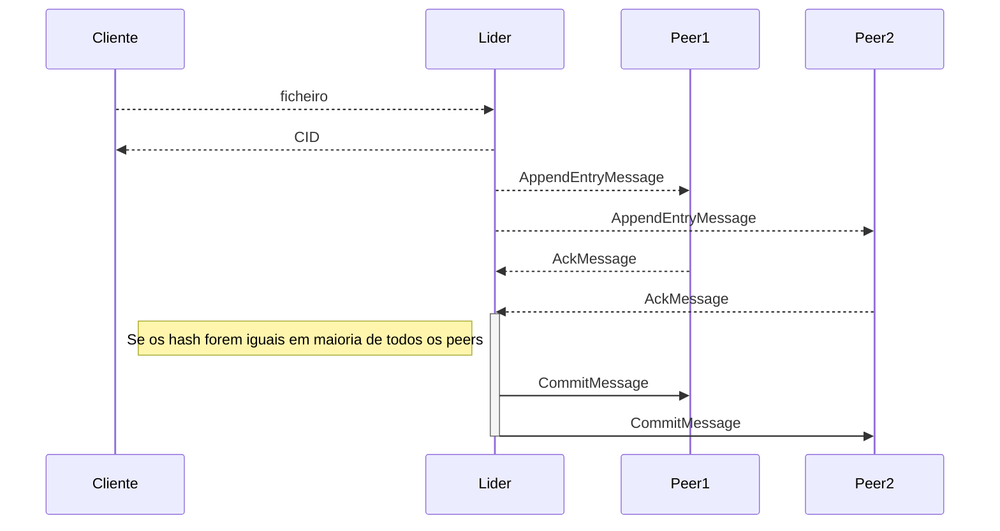

# Protocolo de comunicação:

## Protocolos:

O protocolo que será implementado como solução é o `Raft`, para determinar o consenso entre os vários peers.

- Neste momento, ainda não está a ser implementado do candidato a líder.

- Quando um cliente faz upload do ficheiro em determinado momento existirá várias versões, dessa forma os peers enviam um `hash` e se for igual em maioria dos peers, o lider faz commit da versão mais recente.

**Diagrama de sequência:**

O cliente envia um ficheiro ao líder, depois o líder envia o ficheiro para a rede do IPFS e guarda o CID num vetor de CIDs temporário. Logo a seguir envia esse vetor com os embeddings para o bus AEM (AppendEntryMessage), depois o peer vai receber a mensagem, verifica se é compatível com o seu vetor atual e se não houver conflitos gera um hash que envia pelo bus ACK (AckMessage). Por fim o servidor gera um hash do seu vetor temporário, verifica se é igual à hash recebida por motivos de integridade. Estando tudo válido, incrementa o número de ACK para o vetor temporário e se esse número for >= Npeers / 2 + 1, quer dizer que existe um consenso da rede e envia uma mensagem de commit com a versão do vetor. Os peers ao receber o commit passam o vetor de temporário para principal.
