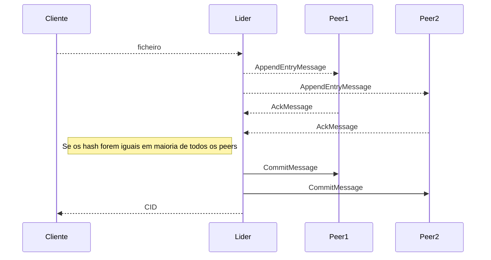
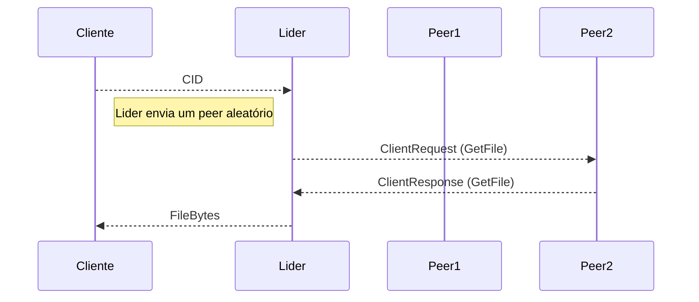
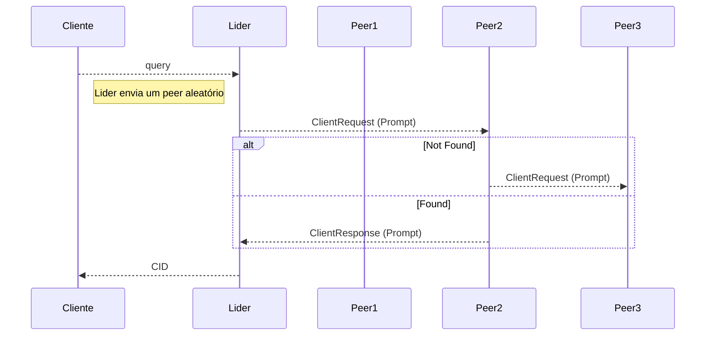

# Sistemas distribuídos

**Trabalho elaborado por:**

- Guilherme Bento

- Ricardo Matos

- Tiago Portugal

- Vasco Aparício

**Disciplina:** Sistemas Distribuídos

## Introdução

    Este trabalho foi constituído por sete *sprints*, nos quais dois foram de recuperação. O projeto consiste na implementação de um sistema distribuído para o armanezamento e recuperação de ficheiros.

    O grupo implementou a solução em go, de modo a utilizar a biblioteca `kubo (go-ipfs)`, na qual é baseada o `ipfs desktop` e `ipfs cli` (basicamente uma abstração da bibilioteca), para criar um projeto mais integrado sem recurso a *wrappers* ou comandos shell.

    Todos os elementos do grupo interpretaram a implementação do projeto em `go` com entusiasmo, para poder ter *feedback* da linguagem, que tem vindo a ganhar popularidade.

## Arquitetura da solução UML

### | Add File - Diagrama de sequência

### | Get File - Diagrama de Sequência

#### |Prompt - Diagrama de sequência:

### | Diagrama de estados

...

## Implementação

...

## Conclusão

...
