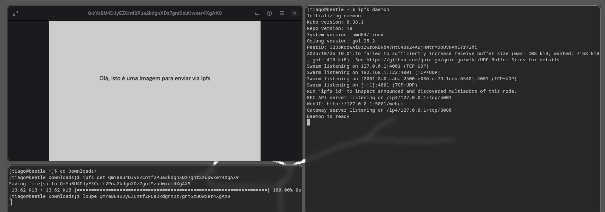

# Notas Sprint 01 | Instalação e configuração inicial

IPFS é simplemente um **protocolo**, pelo que para utilizarmos-o temos que escolher uma implementação.
Na documentação dão bastante ênfase a uma em específico, **[kubo](https://github.com/ipfs/kubo)**, pelo que a selecionamos de forma a ter uma base para nosso projeto bem suportada e documentada. 

Para desenvolvimento e testes por agora vamos utilizar VMs baseadas em debian 13.0 ligadas por uma rede interna NAT, futuramente podemos mover este workflow para contentores. O utilizador que estamos a utilizar nas VMs para fazer todas as operações abaixo é o `root`.

## Instalação do IPFS

Para instalar [kubo](https://github.com/ipfs/kubo), simplemente fazemos download dos binários para linux, e corremos os script de instalação (que simplesmente copia o binário para os locais adequados).

```bash
wget https://dist.ipfs.tech/kubo/v0.38.1/kubo_vXXXX_linux-amd64.tar.gz
tar xzf kubo_vXXXX_linux-amd64.tar.gz
cd kubo
sudo ./install.sh
```

Esta implementação é escrita em [go](https://go.dev), e pode dar jeito ter instalado no sistema operativo.
Também estamos a ponderar em implementar o projeto em go sendo que existe algums exemplos e documentação nesta linguagem de mecanismos que queremos replicar.
Para instalar go/golang basta correr a seguinte instrução em debian

```bash
apt-get install go
```

E com isto temos a implementação do protocolo instalada, apartir daqui, seguindo este [gist](https://github.com/Darkrove/Building-Private-IPFS-Network) foi feito o necessário para criar uma rede interna IPFS.

Em todos os nós começamos com os passos aqui descritos :

1. Criar um serviço (systemd), no caminho `/usr/lib/systemd/system/ipfsd.service`, de modo a que o *daemon* do ipfs seja iniciado em boot

```bash
[Unit]
Description=ipfs daemon

[Service]
Environment="LIBP2P_FORCE_PNET=1"
ExecStart=/usr/local/bin/ipfs daemon
Restart=always
User=root
Group=root

[Install]
WantedBy=multi-user.target
```

2. Gerar uma configuração inicial

```bash
ipfs init
```

## Utilização

Para utilizar o ipfs podemos adicionar um ficheiro ao sistema num peer.
Neste cenário, o peer 1 envia um ficheiro através do seguinte comando:
```bash
ipfs add ./path/randomFile.md
```
Após o envio, o peer um envia o CID retornado na linha de comandos, após adicionar o ficheiro.


O peer 2, recebe o CID do ficheiro, e de seguida, através do seguinte comando consegue visualizar o ficheiro enviado pelo peer 1:
```bash
ipfs get CID
```

**Exemplo:**

Peer 1:


Peer 2:



