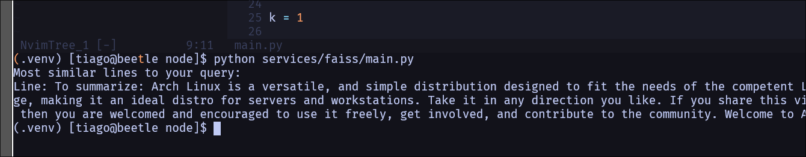

# Sprint 2

    Neste *sprint*, o foco foi desenvolver um array para poder guardar todos os cids dos ficheiros que foram feitos upload e utilizar a biblioteca `FAISS` para criar um *index* com o intuito de pesquisar os ficheiros.

    Após ser feito um *upload* do ficheiro, é pretendido adicionar ao *array* dos cids o cid do novo ficheiro e enviar, juntamente com o *embedding* do documento para cada *peer*.

## Implementação

    Para o desenvolvimeto do vetor para guardar os cids dos ficheiros, foi implementado um `slice`, visto que um `array` em `Go` tinha que se definir o tamanho do array e o objetivo do *sprint* é implementar um `array` que permite guardar vários ficheiros, sem determinar um número máximo. Dessa forma, vou implementado um `slice` no ficheiro `node.go`, na função `main`, através da seguinte linha:

```go
cidVector := []string{}
```

    Na função `main`, é inicializada a api, e é passado como parâmetro o `slice`.

    Para validar o conceito de pesquisa do `FAISS` foi implementado um pequeno exemplo, baseado nas várias fontes de documentação, para a pesquisa de uma linha num documento, em que é gerado os *embeddings* para as várias linhas, onde de seguida, são adicionados a um *index* no FAISS, de modo a que através de uma *query* de onde são gerados também os seus *embeddings* para que depois fazer uma pesquisa no *index* e encontrar os k resultados mais semelhantes.

```python
from sentence_transformers import SentenceTransformer
import faiss
import numpy as np

model = SentenceTransformer('all-MiniLM-L6-v2')  

file_path = 'files/sample.md'

with open(file_path, 'r') as file:
    file_contents = file.read()

file_lines = file_contents.splitlines()

embeddings = model.encode(file_lines)
embeddings = np.array(embeddings)

dimension = embeddings.shape[1]  
index = faiss.IndexFlatL2(dimension)

index.add(embeddings)

query = "To summarise"
query_embedding = model.encode([query])

k = 1

distances, indices = index.search(np.array(query_embedding), k)

print("Most similar lines to your query:")
for i in range(k):
    print(f"Line: {file_lines[indices[0][i]]}, Distance: {distances[0][i]}")\


```

Resultado:



## Contratempos que surgiram:

    Tivemos dificuldade a utilizar a biblioteca `FAISS` inicialmente e atualmente na sua integração com o projeto, devido à não existência de *bindings/wrappers* para o `FAISS` e da biblioteca de embeddings `SentenceTransformer`.

    De momento, estamos a tentar utilizar *scripts* python em go e compreender a exportação/importação de vetores entre as duas linguagens de programação, com o objetivo de implementar os requisitos definidos neste *sprint*.

    Até ao dia da apresentação, o grupo continuará a tentar implementar o resto dos objetivos definidos no *sprint*.


