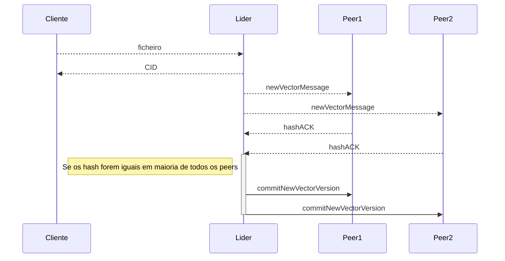

# Protocolo de comunicação:

## Protocolos:

O protocolo que será implementado como solução é o `Raft`, para determinar o consenso entre os vários peers..

- Neste momento, ainda não está a ser implementado do candidato a líder.

- Quando um cliente faz upload do ficheiro em determinado momento existirá várias versões, dessa forma os peers enviam um `hash` e se for igual em todos os peers, o lider faz commit da versão mais recente.

**Diagrama de sequência:**

